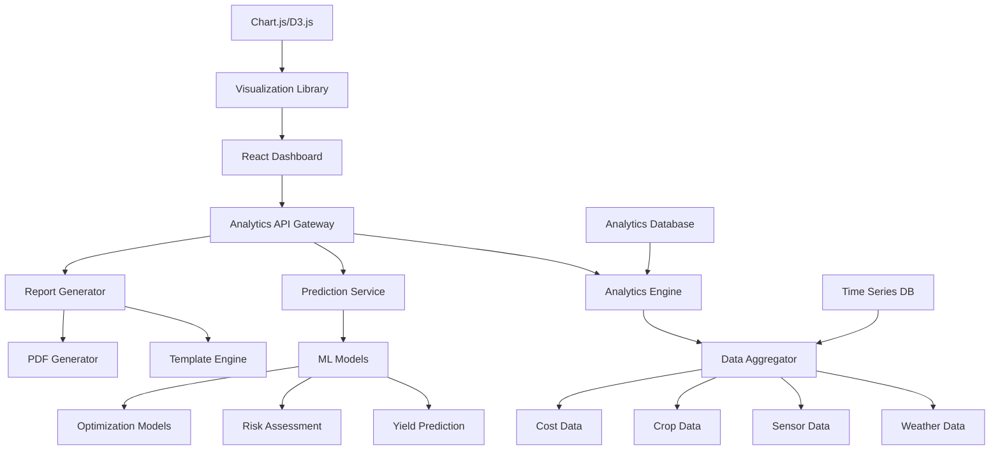

# Advanced Crop Analytics Dashboard - Design Document

## Overview

The Advanced Crop Analytics Dashboard transforms HarvestHub into a comprehensive agricultural intelligence platform. It provides farmers with sophisticated data visualization, predictive analytics, and automated insights to optimize crop management decisions and maximize agricultural productivity.

## Architecture

### High-Level Architecture



### Data Flow Architecture

- **Real-time Analytics**: Stream processing for live dashboard updates
- **Batch Analytics**: Scheduled processing for complex calculations
- **Predictive Pipeline**: ML model inference and forecast generation
- **Visualization Pipeline**: Data transformation for chart rendering

## Components and Interfaces

### 1. Analytics Engine

**Responsibilities:**
- Process and analyze agricultural data from multiple sources
- Calculate key performance indicators and metrics
- Generate automated insights and recommendations
- Detect patterns and anomalies in crop performance

**Key Methods:**
```javascript
class AnalyticsEngine {
  async calculateCropPerformanceMetrics(userId, cropId, timeRange)
  async generateInsights(userId, dataType, analysisType)
  async detectAnomalies(sensorData, thresholds)
  async calculateResourceEfficiency(userId, resourceType, period)
  async generateRecommendations(userId, cropData, environmentalData)
}
```

### 2. Prediction Service

**Responsibilities:**
- Generate crop yield forecasts using ML models
- Assess risk factors and their impact on crop performance
- Provide confidence intervals and prediction accuracy
- Update predictions based on changing conditions

**Key Methods:**
```javascript
class PredictionService {
  async predictCropYield(cropData, weatherData, soilData)
  async assessRiskFactors(cropId, environmentalConditions)
  async updatePredictions(cropId, newData)
  async getConfidenceIntervals(predictionId)
  async generateScenarioAnalysis(cropId, scenarios)
}
```

### 3. Data Aggregator

**Responsibilities:**
- Combine data from weather, sensors, crops, and costs
- Normalize and clean data for analytics processing
- Handle data synchronization and consistency
- Provide unified data access layer

**Key Methods:**
```javascript
class DataAggregator {
  async aggregateMultiSourceData(userId, sources, timeRange)
  async normalizeDataFormats(rawData, targetSchema)
  async calculateDerivedMetrics(baseData, calculations)
  async syncDataSources(sources, syncStrategy)
  async getCombinedDataset(userId, dataTypes, filters)
}
```

### 4. Visualization Library

**Responsibilities:**
- Render interactive charts and graphs
- Handle user interactions and drill-down functionality
- Provide responsive and accessible visualizations
- Support real-time data updates

**Key Components:**
```javascript
// React Components for Visualization
const CropPerformanceChart = ({ data, timeRange, interactive })
const YieldPredictionGraph = ({ predictions, confidence, scenarios })
const ResourceEfficiencyHeatmap = ({ efficiency, resources, periods })
const InteractiveDashboard = ({ widgets, layout, customizable })
const TrendAnalysisChart = ({ trends, comparisons, annotations })
```

## Data Models

### Analytics Metrics Model

```javascript
// MongoDB Schema: AnalyticsMetrics
{
  _id: ObjectId,
  userId: ObjectId,
  cropId: ObjectId,
  fieldId: ObjectId,
  period: {
    startDate: Date,
    endDate: Date,
    granularity: String      // 'daily', 'weekly', 'monthly', 'seasonal'
  },
  performance: {
    yieldPerHectare: Number,
    growthRate: Number,
    healthScore: Number,
    efficiencyRating: Number
  },
  resources: {
    waterUsage: Number,
    fertilizerUsage: Number,
    energyConsumption: Number,
    laborHours: Number
  },
  costs: {
    inputCosts: Number,
    operationalCosts: Number,
    revenue: Number,
    profitMargin: Number
  },
  environmental: {
    averageTemperature: Number,
    totalRainfall: Number,
    soilMoisture: Number,
    sunlightHours: Number
  },
  calculatedAt: Date,
  version: String
}
```

### Prediction Model

```javascript
// MongoDB Schema: CropPrediction
{
  _id: ObjectId,
  userId: ObjectId,
  cropId: ObjectId,
  predictionType: String,    // 'yield', 'harvest_date', 'risk_assessment'
  modelVersion: String,
  inputData: {
    currentGrowthStage: String,
    soilConditions: Object,
    weatherForecast: Object,
    historicalPerformance: Object
  },
  predictions: {
    expectedYield: Number,
    confidenceInterval: {
      lower: Number,
      upper: Number,
      confidence: Number      // Percentage
    },
    harvestDate: Date,
    riskFactors: [{
      factor: String,
      impact: Number,         // -1 to 1 scale
      probability: Number     // 0 to 1 scale
    }]
  },
  accuracy: {
    historicalAccuracy: Number,
    modelPerformance: Object
  },
  createdAt: Date,
  validUntil: Date
}
```

### Dashboard Configuration Model

```javascript
// MongoDB Schema: DashboardConfiguration
{
  _id: ObjectId,
  userId: ObjectId,
  name: String,
  layout: [{
    widgetId: String,
    position: { x: Number, y: Number, w: Number, h: Number },
    configuration: {
      chartType: String,
      dataSource: String,
      filters: Object,
      displayOptions: Object
    }
  }],
  filters: {
    dateRange: { start: Date, end: Date },
    crops: [ObjectId],
    fields: [ObjectId],
    metrics: [String]
  },
  isDefault: Boolean,
  isShared: Boolean,
  createdAt: Date,
  updatedAt: Date
}
```

### Insight Model

```javascript
// MongoDB Schema: AutomatedInsight
{
  _id: ObjectId,
  userId: ObjectId,
  insightType: String,       // 'performance', 'efficiency', 'prediction', 'anomaly'
  priority: String,          // 'low', 'medium', 'high', 'critical'
  title: String,
  description: String,
  data: {
    affectedCrops: [ObjectId],
    metrics: Object,
    evidence: Object,
    confidence: Number
  },
  recommendations: [{
    action: String,
    impact: String,
    effort: String,
    timeline: String
  }],
  status: String,            // 'new', 'viewed', 'acted_upon', 'dismissed'
  generatedAt: Date,
  expiresAt: Date
}
```

## Error Handling

### Data Processing Errors
- **Missing Data**: Implement graceful handling with interpolation or default values
- **Data Quality Issues**: Validate and flag questionable data points
- **Calculation Errors**: Provide fallback calculations and error reporting
- **Model Failures**: Handle ML model errors with alternative approaches

### Visualization Errors
- **Chart Rendering Failures**: Provide fallback visualizations and error messages
- **Performance Issues**: Implement data sampling and progressive loading
- **Browser Compatibility**: Ensure cross-browser chart rendering support
- **Responsive Design**: Handle various screen sizes and orientations

## Testing Strategy

### Unit Testing
- Analytics calculation accuracy tests
- Data aggregation and normalization tests
- Prediction model validation tests
- Chart component rendering tests

### Integration Testing
- End-to-end analytics pipeline tests
- Dashboard interaction and drill-down tests
- Real-time data update tests
- Cross-component data flow tests

### Performance Testing
- Large dataset processing performance
- Chart rendering performance with big data
- Real-time update responsiveness
- Memory usage optimization tests

## Security Considerations

### Data Access Control
- Role-based access to analytics features
- Field-level security for sensitive metrics
- Audit logging for analytics access
- Secure API endpoints for analytics data

### Privacy Protection
- Anonymization of comparative analytics
- Secure storage of prediction models
- Data retention policies for analytics
- User consent for data usage in insights

## Performance Optimization

### Data Processing
- Implement caching for frequently accessed analytics
- Use database indexing for fast query performance
- Implement data pre-aggregation for common metrics
- Optimize ML model inference performance

### Frontend Performance
- Lazy loading for dashboard components
- Virtual scrolling for large datasets
- Chart data sampling for performance
- Progressive enhancement for complex visualizations

### Real-time Updates
- WebSocket optimization for live data
- Efficient state management for dashboard updates
- Debounced updates to prevent excessive re-rendering
- Smart caching strategies for real-time analytics