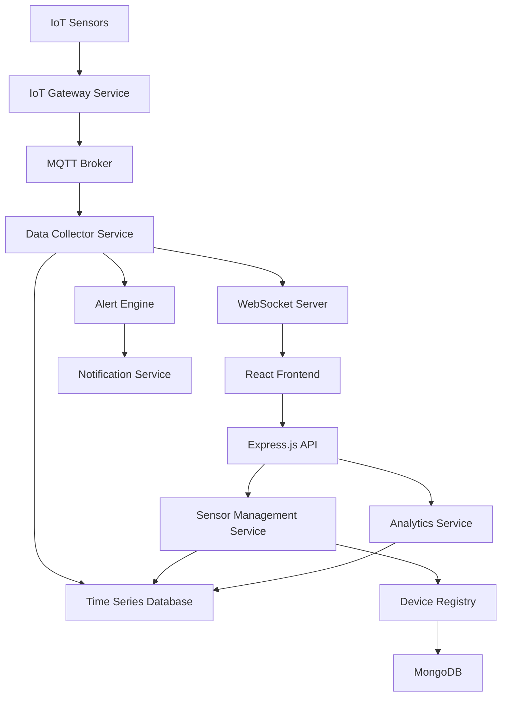

# IoT Sensor Integration - Design Document

## Overview

The IoT Sensor Integration feature creates a comprehensive sensor management system that connects agricultural IoT devices to HarvestHub. The system supports multiple communication protocols, real-time data processing, and intelligent alerting to provide farmers with continuous field monitoring capabilities.

## Architecture

### High-Level Architecture



### Communication Protocols

- **MQTT**: Primary protocol for sensor data transmission
- **WebSocket**: Real-time data streaming to frontend
- **HTTP/REST**: Sensor configuration and management
- **LoRaWAN**: Long-range, low-power sensor communication

## Components and Interfaces

### 1. IoT Gateway Service

**Responsibilities:**
- Manage sensor device connections and authentication
- Handle multiple communication protocols
- Implement device discovery and registration
- Provide connection health monitoring

**Key Methods:**
```javascript
class IoTGatewayService {
  async registerDevice(deviceId, deviceType, protocol, credentials)
  async authenticateDevice(deviceId, token)
  async getDeviceStatus(deviceId)
  async updateDeviceConfiguration(deviceId, config)
  async handleDeviceDisconnection(deviceId)
}
```

### 2. Data Collector Service

**Responsibilities:**
- Receive and validate sensor data
- Process and normalize sensor readings
- Store data in time series database
- Trigger real-time alerts and notifications

**Key Methods:**
```javascript
class DataCollectorService {
  async processSensorReading(deviceId, sensorType, value, timestamp)
  async validateSensorData(reading)
  async storeSensorData(deviceId, readings)
  async getLatestReadings(deviceId, sensorTypes)
  async aggregateHistoricalData(deviceId, timeRange, granularity)
}
```

### 3. Alert Engine

**Responsibilities:**
- Monitor sensor readings against thresholds
- Generate contextual alerts based on crop requirements
- Manage alert escalation and notification delivery
- Track alert acknowledgment and resolution

**Key Methods:**
```javascript
class AlertEngine {
  async evaluateThresholds(deviceId, readings, cropType)
  async generateAlert(deviceId, alertType, severity, message)
  async getActiveAlerts(userId)
  async acknowledgeAlert(alertId, userId)
  async updateThresholds(deviceId, sensorType, thresholds)
}
```

### 4. Sensor Management Service

**Responsibilities:**
- Manage sensor device registry and metadata
- Handle sensor configuration and calibration
- Provide sensor status and health monitoring
- Support sensor grouping and field mapping

**Key Methods:**
```javascript
class SensorManagementService {
  async addSensor(userId, sensorData)
  async updateSensorConfiguration(sensorId, config)
  async calibrateSensor(sensorId, calibrationData)
  async getSensorsByField(fieldId)
  async getSensorHealth(sensorId)
}
```

## Data Models

### Sensor Device Model

```javascript
// MongoDB Schema: SensorDevice
{
  _id: ObjectId,
  userId: ObjectId,
  deviceId: String,           // Unique device identifier
  deviceType: String,         // 'soil_moisture', 'ph_sensor', 'temperature', 'nutrient'
  name: String,               // User-defined sensor name
  location: {
    fieldId: ObjectId,
    latitude: Number,
    longitude: Number,
    depth: Number             // For soil sensors
  },
  configuration: {
    protocol: String,         // 'mqtt', 'lorawan', 'wifi'
    readingInterval: Number,  // Minutes between readings
    thresholds: {
      min: Number,
      max: Number,
      optimal: { min: Number, max: Number }
    }
  },
  calibration: {
    lastCalibrated: Date,
    calibrationFactor: Number,
    nextCalibrationDue: Date
  },
  status: {
    isOnline: Boolean,
    lastSeen: Date,
    batteryLevel: Number,
    signalStrength: Number
  },
  createdAt: Date,
  updatedAt: Date
}
```

### Sensor Reading Model (Time Series)

```javascript
// InfluxDB Schema: SensorReading
{
  measurement: "sensor_readings",
  tags: {
    deviceId: String,
    sensorType: String,
    userId: String,
    fieldId: String
  },
  fields: {
    value: Number,
    unit: String,
    quality: String,          // 'good', 'questionable', 'bad'
    batteryLevel: Number,
    signalStrength: Number
  },
  timestamp: Date
}
```

### Sensor Alert Model

```javascript
// MongoDB Schema: SensorAlert
{
  _id: ObjectId,
  userId: ObjectId,
  deviceId: String,
  sensorType: String,
  alertType: String,          // 'threshold_exceeded', 'device_offline', 'calibration_needed'
  severity: String,           // 'low', 'medium', 'high', 'critical'
  title: String,
  message: String,
  thresholdValue: Number,
  actualValue: Number,
  recommendations: [String],
  isActive: Boolean,
  acknowledgedAt: Date,
  resolvedAt: Date,
  createdAt: Date
}
```

### Field Configuration Model

```javascript
// MongoDB Schema: FieldConfiguration
{
  _id: ObjectId,
  userId: ObjectId,
  name: String,
  location: {
    coordinates: [[Number]],   // GeoJSON polygon
    area: Number,              // Square meters
    soilType: String
  },
  crops: [{
    cropType: String,
    plantingDate: Date,
    expectedHarvest: Date,
    growthStage: String
  }],
  sensors: [ObjectId],        // References to SensorDevice
  optimalConditions: {
    soilMoisture: { min: Number, max: Number },
    pH: { min: Number, max: Number },
    temperature: { min: Number, max: Number },
    nutrients: {
      nitrogen: Number,
      phosphorus: Number,
      potassium: Number
    }
  },
  createdAt: Date,
  updatedAt: Date
}
```

## Error Handling

### Sensor Communication Failures
- **Connection Loss**: Implement exponential backoff retry mechanism
- **Data Corruption**: Validate sensor readings and flag anomalous data
- **Protocol Errors**: Support multiple communication protocols as fallbacks
- **Device Malfunction**: Detect and alert on sensor hardware issues

### Data Processing Errors
- **Invalid Readings**: Implement data validation and quality scoring
- **Storage Failures**: Use message queues for reliable data persistence
- **Processing Delays**: Implement real-time and batch processing modes
- **Calibration Drift**: Automatic detection and calibration reminders

## Testing Strategy

### Unit Testing
- Sensor data validation and processing logic
- Alert threshold evaluation algorithms
- Device registration and authentication
- Data aggregation and analytics functions

### Integration Testing
- End-to-end sensor data flow testing
- MQTT broker and WebSocket communication
- Database storage and retrieval operations
- Alert generation and notification delivery

### Hardware Testing
- Sensor device compatibility testing
- Communication protocol reliability tests
- Battery life and power management tests
- Environmental condition stress testing

## Security Considerations

### Device Security
- Secure device authentication and authorization
- Encrypted communication channels (TLS/SSL)
- Device certificate management
- Firmware update security

### Data Security
- Sensor data encryption at rest and in transit
- Access control for sensor configurations
- Audit logging for device management operations
- Secure API endpoints for sensor data access

## Performance Optimization

### Real-time Processing
- Stream processing for high-frequency sensor data
- WebSocket optimization for real-time dashboard updates
- Efficient time series data storage and querying
- Caching strategies for frequently accessed sensor data

### Scalability
- Horizontal scaling for IoT gateway services
- Load balancing for MQTT broker connections
- Database sharding for time series data
- Microservice architecture for independent scaling