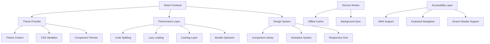

# UI/UX Enhancement & Performance Optimization - Design Document

## Overview

The UI/UX Enhancement & Performance Optimization feature transforms HarvestHub into a modern, fast, and accessible agricultural platform. This comprehensive redesign focuses on visual appeal, performance optimization, dark mode implementation, and enhanced user experience while maintaining the platform's agricultural focus and functionality.

## Architecture

### High-Level Architecture



### Performance Architecture

- **Bundle Optimization**: Code splitting and tree shaking for minimal bundle sizes
- **Resource Loading**: Progressive loading with priority-based resource management
- **Caching Strategy**: Multi-level caching including browser, service worker, and CDN
- **Rendering Optimization**: Virtual scrolling and canvas-based chart rendering

## Components and Interfaces

### 1. Theme System

**Responsibilities:**
- Manage light and dark theme switching
- Persist user theme preferences
- Provide theme context to all components
- Handle system theme detection

**Key Methods:**
```javascript
class ThemeSystem {
  async initializeTheme()
  async switchTheme(themeName)
  async detectSystemTheme()
  async persistThemePreference(userId, theme)
  async getThemeVariables(themeName)
}
```

### 2. Performance Optimizer

**Responsibilities:**
- Implement code splitting and lazy loading
- Manage resource optimization and caching
- Monitor performance metrics
- Optimize bundle sizes and loading strategies

**Key Methods:**
```javascript
class PerformanceOptimizer {
  async optimizeBundleLoading()
  async implementLazyLoading(components)
  async setupServiceWorker()
  async monitorPerformanceMetrics()
  async optimizeImageLoading(images)
}
```

### 3. Design System

**Responsibilities:**
- Provide consistent UI components and styling
- Implement responsive design patterns
- Manage typography and spacing systems
- Ensure visual consistency across the platform

**Key Components:**
```javascript
// Design System Components
const Button = ({ variant, size, theme, children, ...props })
const Card = ({ elevation, theme, children, ...props })
const Input = ({ variant, validation, theme, ...props })
const Modal = ({ size, theme, onClose, children, ...props })
const Navigation = ({ items, theme, responsive, ...props })
```

### 4. Animation Library

**Responsibilities:**
- Provide smooth transitions and micro-interactions
- Implement loading animations and skeleton screens
- Handle page transitions and state changes
- Optimize animation performance

**Key Animations:**
```javascript
// Animation Components
const FadeTransition = ({ duration, children, ...props })
const SlideTransition = ({ direction, duration, children, ...props })
const LoadingSkeleton = ({ variant, theme, ...props })
const ProgressIndicator = ({ progress, theme, animated, ...props })
const MicroInteraction = ({ trigger, animation, children, ...props })
```

## Data Models

### Theme Configuration Model

```javascript
// Theme Configuration Schema
{
  name: String,              // 'light', 'dark', 'auto'
  colors: {
    primary: {
      50: String,            // Lightest shade
      100: String,
      200: String,
      300: String,
      400: String,
      500: String,           // Base color
      600: String,
      700: String,
      800: String,
      900: String            // Darkest shade
    },
    secondary: { /* similar structure */ },
    background: {
      primary: String,
      secondary: String,
      tertiary: String
    },
    text: {
      primary: String,
      secondary: String,
      disabled: String
    },
    border: {
      light: String,
      medium: String,
      heavy: String
    }
  },
  typography: {
    fontFamily: {
      primary: String,
      secondary: String,
      monospace: String
    },
    fontSize: {
      xs: String,
      sm: String,
      base: String,
      lg: String,
      xl: String,
      '2xl': String,
      '3xl': String
    },
    fontWeight: {
      light: Number,
      normal: Number,
      medium: Number,
      semibold: Number,
      bold: Number
    }
  },
  spacing: {
    xs: String,
    sm: String,
    md: String,
    lg: String,
    xl: String,
    '2xl': String
  },
  borderRadius: {
    none: String,
    sm: String,
    md: String,
    lg: String,
    full: String
  },
  shadows: {
    sm: String,
    md: String,
    lg: String,
    xl: String
  }
}
```

### Performance Metrics Model

```javascript
// Performance Metrics Schema
{
  _id: ObjectId,
  userId: ObjectId,
  sessionId: String,
  metrics: {
    pageLoadTime: Number,     // Milliseconds
    firstContentfulPaint: Number,
    largestContentfulPaint: Number,
    firstInputDelay: Number,
    cumulativeLayoutShift: Number,
    timeToInteractive: Number
  },
  resources: {
    bundleSize: Number,       // Bytes
    imageSize: Number,
    totalResources: Number,
    cachedResources: Number
  },
  userAgent: String,
  connectionType: String,
  timestamp: Date
}
```

### User Preferences Model

```javascript
// User UI Preferences Schema
{
  _id: ObjectId,
  userId: ObjectId,
  preferences: {
    theme: String,            // 'light', 'dark', 'auto'
    language: String,
    animations: Boolean,      // Enable/disable animations
    reducedMotion: Boolean,   // Accessibility preference
    fontSize: String,         // 'small', 'medium', 'large'
    density: String,          // 'compact', 'comfortable', 'spacious'
    dashboardLayout: Object,  // Custom dashboard configuration
    notifications: {
      desktop: Boolean,
      email: Boolean,
      sound: Boolean
    }
  },
  updatedAt: Date
}
```

## Error Handling

### Performance Degradation
- **Slow Loading**: Implement progressive enhancement and graceful degradation
- **Memory Issues**: Monitor memory usage and implement cleanup mechanisms
- **Network Failures**: Provide offline functionality and retry mechanisms
- **Bundle Errors**: Implement error boundaries and fallback loading strategies

### Theme System Failures
- **Theme Loading Errors**: Provide fallback to default theme
- **CSS Variable Issues**: Implement polyfills for older browsers
- **Preference Sync Failures**: Use local storage as backup for theme preferences
- **Animation Performance**: Disable animations on low-performance devices

## Testing Strategy

### Performance Testing
- Lighthouse audits for performance, accessibility, and SEO
- Bundle size analysis and optimization verification
- Loading time tests across different network conditions
- Memory leak detection and cleanup verification

### Visual Testing
- Cross-browser compatibility testing
- Responsive design testing across device sizes
- Theme switching and consistency testing
- Animation performance and smoothness testing

### Accessibility Testing
- Screen reader compatibility testing
- Keyboard navigation testing
- Color contrast and WCAG compliance verification
- Focus management and ARIA attribute testing

### User Experience Testing
- Usability testing with real users
- A/B testing for design improvements
- Performance impact on user workflows
- Mobile and touch interaction testing

## Security Considerations

### Client-Side Security
- Secure theme preference storage
- Protection against XSS in dynamic styling
- Secure service worker implementation
- Safe handling of user preferences and settings

### Performance Security
- Prevent resource exhaustion attacks
- Secure caching strategies
- Protection against malicious animations
- Safe handling of user-generated content in UI

## Performance Optimization

### Loading Optimization
- **Code Splitting**: Split bundles by route and feature
- **Tree Shaking**: Remove unused code from bundles
- **Image Optimization**: Implement WebP format with fallbacks
- **Resource Hints**: Use preload, prefetch, and preconnect directives

### Runtime Optimization
- **Virtual Scrolling**: Implement for large data lists
- **Memoization**: Use React.memo and useMemo for expensive calculations
- **Debouncing**: Implement for search and filter operations
- **Canvas Rendering**: Use for complex charts and visualizations

### Caching Strategy
- **Service Worker**: Implement for offline functionality and caching
- **Browser Cache**: Optimize cache headers for static resources
- **Memory Cache**: Implement in-memory caching for frequently accessed data
- **CDN Integration**: Use CDN for static assets and images

## Accessibility Implementation

### WCAG 2.1 AA Compliance
- **Color Contrast**: Ensure minimum 4.5:1 contrast ratio
- **Keyboard Navigation**: Full keyboard accessibility for all features
- **Screen Reader Support**: Proper ARIA labels and semantic HTML
- **Focus Management**: Clear focus indicators and logical tab order

### Inclusive Design
- **Reduced Motion**: Respect user's motion preferences
- **Font Scaling**: Support browser font size adjustments
- **High Contrast**: Provide high contrast theme option
- **Touch Targets**: Ensure minimum 44px touch target size

## Animation and Interaction Design

### Micro-Interactions
- **Button States**: Hover, active, and focus animations
- **Form Feedback**: Real-time validation and success indicators
- **Loading States**: Engaging loading animations and progress indicators
- **Transitions**: Smooth page and component transitions

### Performance Considerations
- **GPU Acceleration**: Use transform and opacity for animations
- **Animation Optimization**: Limit concurrent animations
- **Reduced Motion**: Provide alternatives for users with motion sensitivity
- **Frame Rate**: Maintain 60fps for smooth animations