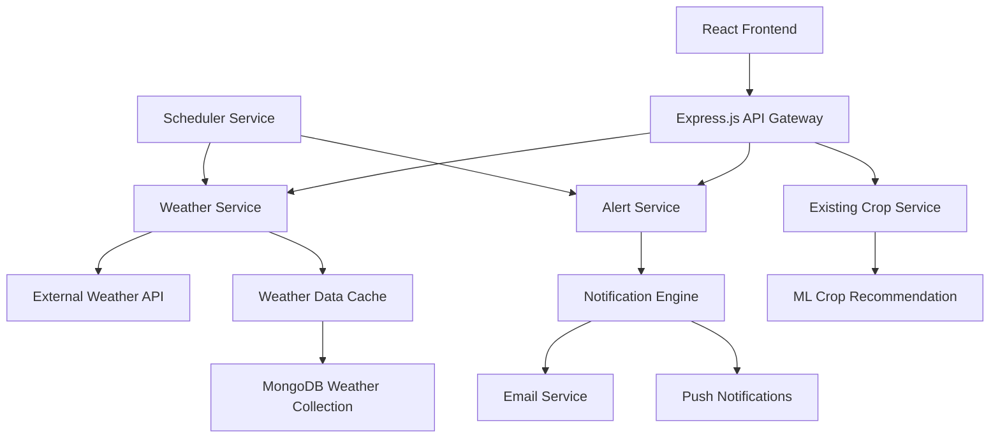

# Weather Integration & Alerts - Design Document

## Overview

The Smart Weather Integration & Alerts feature extends HarvestHub with comprehensive weather services that provide real-time conditions, forecasts, and intelligent alerts. The system integrates with external weather APIs and correlates weather data with existing crop recommendations to deliver actionable agricultural insights.

## Architecture

### High-Level Architecture



### Service Integration Points

- **Weather Service**: New microservice handling weather data operations
- **Alert Service**: New service for weather-based notifications
- **Enhanced Crop Service**: Extended to incorporate weather data
- **Notification Engine**: New component for multi-channel alerts

## Components and Interfaces

### 1. Weather Service Component

**Responsibilities:**
- Fetch real-time weather data from external APIs
- Cache weather data for performance
- Provide weather history and trends
- Integrate with location services

**Key Methods:**
```javascript
// Weather Service Interface
class WeatherService {
  async getCurrentWeather(latitude, longitude)
  async getWeatherForecast(latitude, longitude, days = 7)
  async getWeatherHistory(latitude, longitude, startDate, endDate)
  async updateWeatherCache()
}
```

### 2. Alert Service Component

**Responsibilities:**
- Monitor weather conditions for alert triggers
- Generate crop-specific weather alerts
- Manage alert preferences and delivery
- Track alert history and effectiveness

**Key Methods:**
```javascript
// Alert Service Interface
class AlertService {
  async checkWeatherAlerts(userId, weatherData)
  async createAlert(userId, alertType, severity, message)
  async getUserAlertPreferences(userId)
  async sendAlert(userId, alert, channels)
}
```

### 3. Enhanced Crop Analyzer

**Responsibilities:**
- Correlate weather data with crop recommendations
- Calculate weather compatibility scores
- Suggest optimal planting schedules
- Provide weather-aware farming advice

**Key Methods:**
```javascript
// Enhanced Crop Analyzer Interface
class CropWeatherAnalyzer {
  async getWeatherAwareCropRecommendations(soilData, weatherData, location)
  async calculateWeatherCompatibility(cropType, weatherForecast)
  async suggestOptimalPlantingWindow(cropType, location, currentDate)
}
```

### 4. Weather Dashboard Component (Frontend)

**Responsibilities:**
- Display current weather conditions
- Show weather forecasts and trends
- Present weather alerts and notifications
- Integrate weather data with crop recommendations

**Key Features:**
- Real-time weather widgets
- Interactive forecast charts
- Alert management interface
- Weather-crop correlation displays

## Data Models

### Weather Data Model

```javascript
// MongoDB Schema: WeatherData
{
  _id: ObjectId,
  location: {
    latitude: Number,
    longitude: Number,
    city: String,
    country: String
  },
  timestamp: Date,
  current: {
    temperature: Number,      // Celsius
    humidity: Number,         // Percentage
    pressure: Number,         // hPa
    windSpeed: Number,        // km/h
    windDirection: Number,    // Degrees
    rainfall: Number,         // mm
    uvIndex: Number,
    visibility: Number        // km
  },
  forecast: [{
    date: Date,
    tempMax: Number,
    tempMin: Number,
    humidity: Number,
    precipitationChance: Number,
    precipitationAmount: Number,
    windSpeed: Number,
    conditions: String
  }],
  source: String,            // API provider
  createdAt: Date,
  expiresAt: Date           // TTL for cache
}
```

### Weather Alert Model

```javascript
// MongoDB Schema: WeatherAlert
{
  _id: ObjectId,
  userId: ObjectId,
  alertType: String,        // 'extreme_weather', 'crop_risk', 'optimal_conditions'
  severity: String,         // 'low', 'medium', 'high', 'critical'
  title: String,
  message: String,
  weatherConditions: {
    temperature: Number,
    rainfall: Number,
    windSpeed: Number,
    humidity: Number
  },
  affectedCrops: [String],
  recommendations: [String],
  isActive: Boolean,
  sentAt: Date,
  acknowledgedAt: Date,
  createdAt: Date
}
```

### User Weather Preferences Model

```javascript
// MongoDB Schema: UserWeatherPreferences
{
  _id: ObjectId,
  userId: ObjectId,
  location: {
    latitude: Number,
    longitude: Number,
    city: String,
    autoDetect: Boolean
  },
  alertPreferences: {
    extremeWeather: Boolean,
    cropRisks: Boolean,
    optimalConditions: Boolean,
    advanceNoticeHours: Number,
    channels: ['email', 'push', 'sms']
  },
  crops: [String],          // User's current crops for targeted alerts
  updatedAt: Date
}
```

## Error Handling

### Weather API Failures
- **Fallback Strategy**: Use cached data with clear timestamps
- **Retry Logic**: Exponential backoff for API calls
- **Multiple Providers**: Implement secondary weather API as backup
- **Graceful Degradation**: Show limited functionality when weather data unavailable

### Alert System Failures
- **Queue Management**: Implement alert queue with retry mechanism
- **Delivery Confirmation**: Track alert delivery status
- **Fallback Channels**: Use alternative notification methods if primary fails
- **Rate Limiting**: Prevent alert spam with intelligent throttling

### Data Consistency
- **Cache Invalidation**: Implement proper TTL and refresh strategies
- **Data Validation**: Validate weather data before storage and display
- **Conflict Resolution**: Handle discrepancies between multiple weather sources

## Testing Strategy

### Unit Testing
- Weather service API integration tests
- Alert generation logic tests
- Data model validation tests
- Weather-crop correlation algorithm tests

### Integration Testing
- End-to-end weather data flow tests
- Alert delivery system tests
- Frontend-backend weather API tests
- External weather API integration tests

### Performance Testing
- Weather API response time tests
- Cache performance under load
- Alert system scalability tests
- Database query optimization tests

### User Acceptance Testing
- Weather dashboard usability tests
- Alert relevance and timing tests
- Mobile responsiveness tests
- Cross-browser compatibility tests

## Security Considerations

### API Security
- Secure storage of weather API keys
- Rate limiting for external API calls
- Input validation for location data
- HTTPS enforcement for all weather endpoints

### Data Privacy
- Location data encryption at rest
- User consent for location tracking
- GDPR compliance for weather preferences
- Secure deletion of historical weather data

### Alert Security
- Prevent alert injection attacks
- Validate alert content before delivery
- Secure notification channels
- User authentication for alert preferences

## Performance Optimization

### Caching Strategy
- Redis cache for frequently accessed weather data
- CDN for weather icons and static assets
- Browser caching for weather dashboard components
- Database indexing for weather queries

### API Optimization
- Batch weather requests for multiple users
- Compress weather data responses
- Implement weather data pagination
- Use WebSocket for real-time weather updates

### Scalability Considerations
- Horizontal scaling for weather services
- Load balancing for weather API calls
- Database sharding for weather history
- Microservice architecture for independent scaling